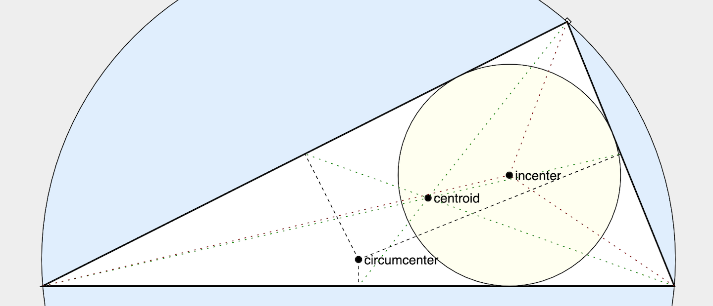

# [Constrain](https://github.com/andrewcmyers/constrain) - a JS (ES6) library for responsive, animated figures, based on declarative constraint solving

- Supports responsive, animated figures embedded in web pages
- Figures implemented declaratively with time-dependent constraints on graphical objects
- Integrates with [Reveal.js](https://revealjs.com) presentations
- [GitHub repository](https://github.com/andrewcmyers/constrain)
- [Reference manual](https://andrewcmyers.github.io/constrain/doc)

## Demos

[Using constraints to compute the Golden Ratio](https://andrewcmyers.github.io/constrain/examples/spiral.html) (Drag the diamond!)

[Reveal/Constrain integration](https://andrewcmyers.github.io/constrain/examples/reveal-demo.html)

Cornell University course notes using Constrain for embedded figures: [CS 2112](https://www.cs.cornell.edu/courses/cs2112/2019fa/lectures/lecture.html?id=objects),
[CS 4120/lexer generation](https://www.cs.cornell.edu/courses/cs4120/2021sp/notes.html?id=leximpl),
[CS 4120/bottom-up parsing](https://www.cs.cornell.edu/courses/cs4120/2020sp/notes.html?id=bottomup)

[Interactive Pythagorean Theorem](https://andrewcmyers.github.io/constrain/examples/pythagoras.html)

[Animated solving of triangle constraints](https://andrewcmyers.github.io/constrain/examples/triangles.html)
[TeX-style text formatting](https://andrewcmyers.github.io/constrain/examples/text-format.html)

[Simple template page for using Constrain](https://andrewcmyers.github.io/constrain/examples/template.html)

## Requirements

- ES6-capable web browser
    - Tested on Chrome, Firefox, Safari, Opera
    - Does not work on Internet Explorer or Opera Mini
- Numeric.js version 1.2.6 (included)
