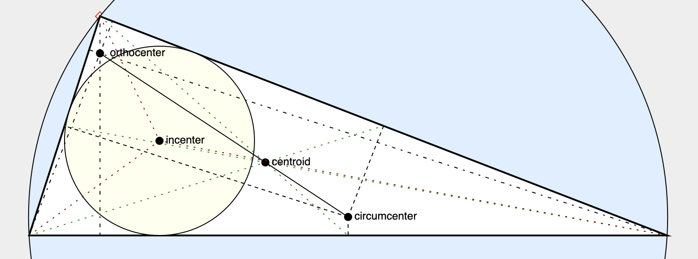

# [Constrain](https://andrewcmyers.github.io/constrain/) - a JS (ES6) library for animated, interactive web figures, based on declarative constraint solving

- Responsive, animated figures embedded in web pages
- Figures implemented declaratively with time-dependent constraints on graphical objects
- Integrates with [Reveal.js](https://revealjs.com) presentations
- [GitHub repository](https://github.com/andrewcmyers/constrain)
- [Reference manual](https://andrewcmyers.github.io/constrain/doc)
- [A short talk about Constrain](https://www.youtube.com/watch?v=UN_HOWSijNI) ([HTML/Reveal source](https://andrewcmyers.github.io/constrain/examples/talk.html))

## Demos

[Interactive Pythagorean Theorem](https://andrewcmyers.github.io/constrain/examples/pythagoras.html)

[Interactively computing centers of a triangle](https://andrewcmyers.github.io/constrain/examples/triangles.html)

[Animated trees](https://andrewcmyers.github.io/constrain/examples/ll_lr.html)

[Loyd 15-puzzle](https://andrewcmyers.github.io/constrain/examples/loyd.html)

[Using constraints to compute the Golden Ratio](https://andrewcmyers.github.io/constrain/examples/spiral.html) (Drag the diamond!)

[TeX-style text formatting](https://andrewcmyers.github.io/constrain/examples/text-format.html)

Cornell University course notes using Constrain for embedded figures: [CS 2112](https://www.cs.cornell.edu/courses/cs2112/2019fa/lectures/lecture.html?id=objects),
[CS 4120/lexer generation](https://www.cs.cornell.edu/courses/cs4120/2023sp/notes.html?id=leximpl),
[CS 4120/bottom-up parsing](https://www.cs.cornell.edu/courses/cs4120/2023sp/notes.html?id=bottomup)

[Simple template page for using Constrain](https://andrewcmyers.github.io/constrain/examples/template.html)

## Requirements

- ES6-capable web browser
    - Tested on Chrome, Opera, Brave, Firefox, Safari (runs best on the first three)
    - Does not work on Internet Explorer or Opera Mini
- Numeric.js version 1.2.6 (included)
